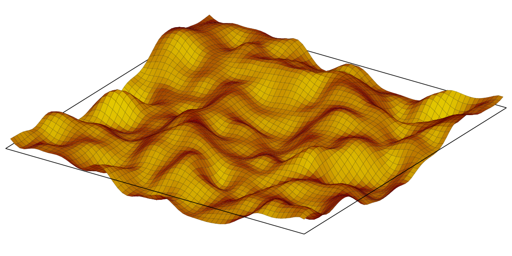
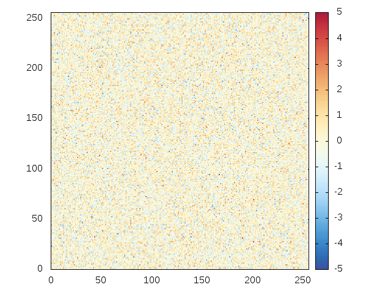
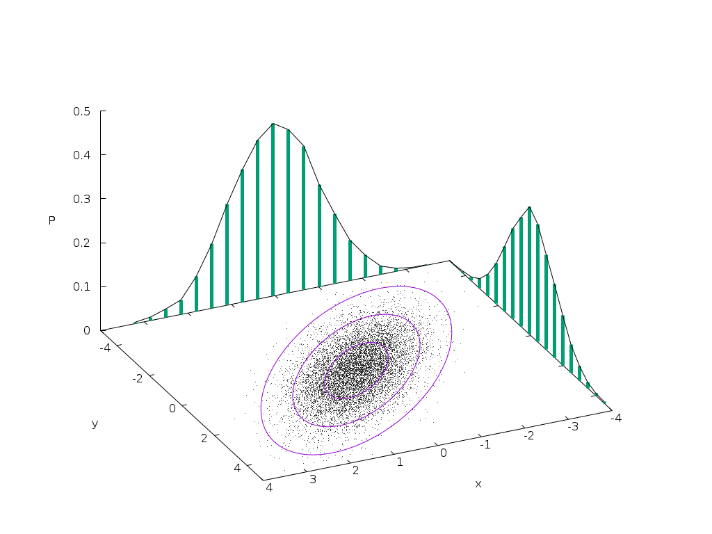
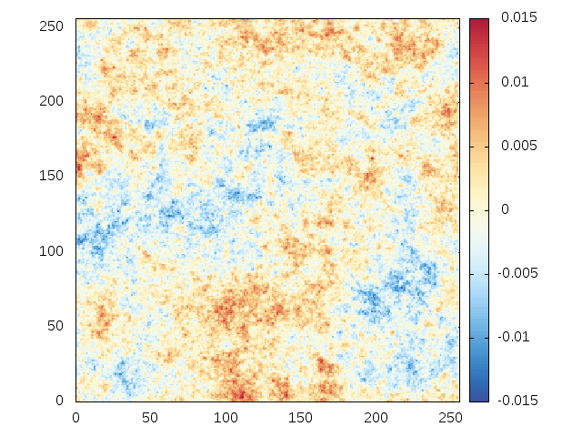
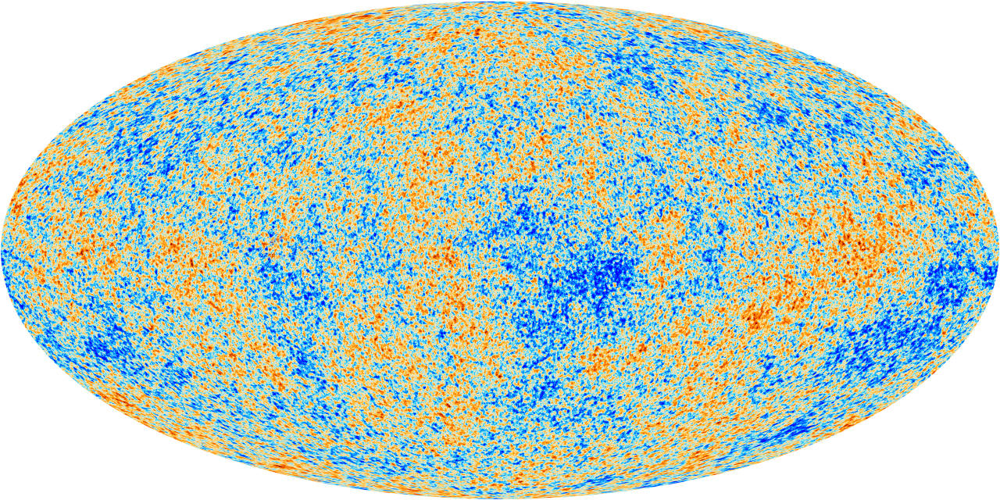
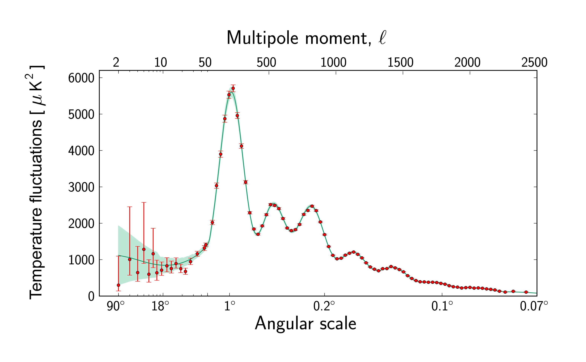
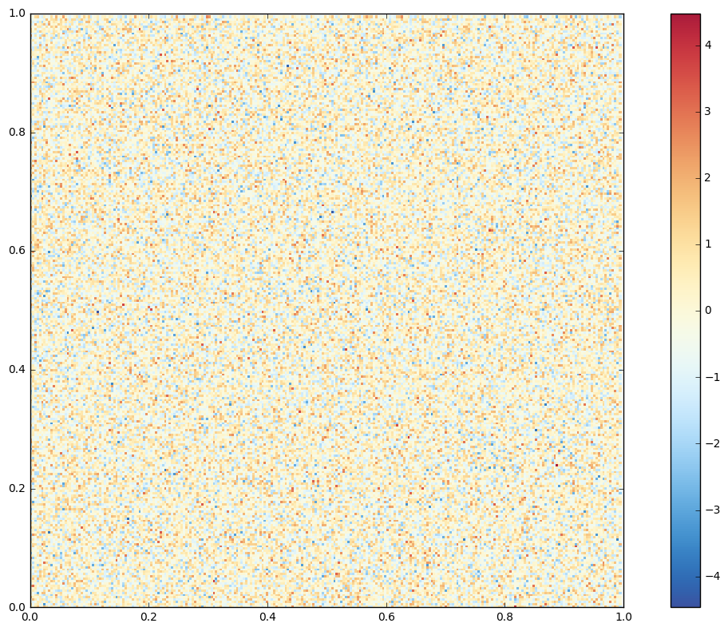
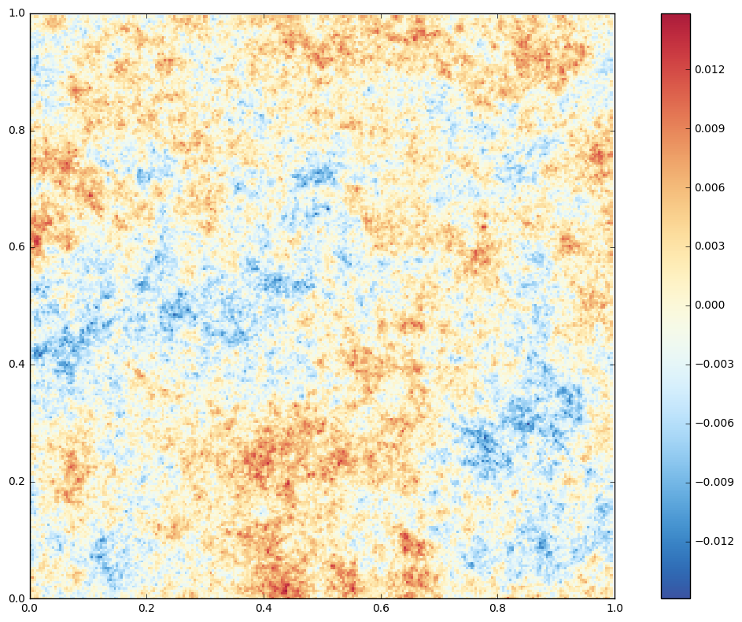
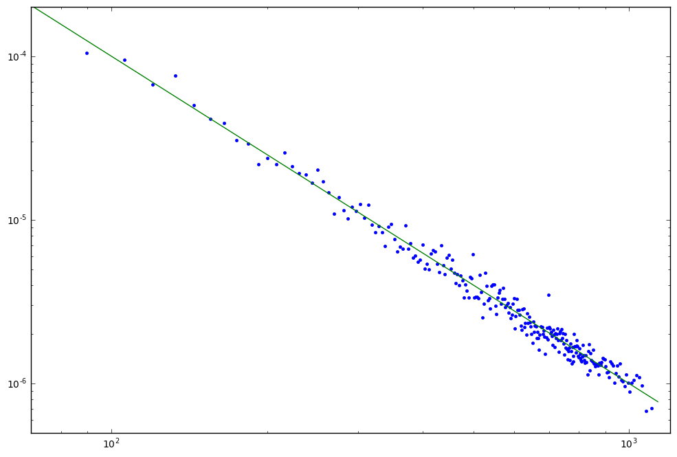

On Gaussian Random Fields
=========================

   A random field

.. math:: \renewcommand\vec[1]{\boldsymbol{#1}}

This talk is on Gaussian Random Fields. Here we consider the statistics
of an entire field of values, like one shown here in the first slide. I
will show both howto draw one instance of such a field from a
distribution and how to get statistics from such a field, when you're
given one.

White Noise
===========

   white noise

Here we see an instance of *white noise*. This is a field of values that
are completely uncorrelated (which is for the purpose of this talk
synonymous to independent). For each location :math:`\vec{x}` in the
domain, the value :math:`y = f(\vec{x})` is an independent Gaussian
variate.

Uncorrelated
============

   dice

Univariate Normal Distribution
~~~~~~~~~~~~~~~~~~~~~~~~~~~~~~

.. math:: P(y_1) = \frac{1}{\sqrt{2\pi} \sigma_1} \exp\left(-\frac{{(y_1 - \mu_1)}^2}{2 \sigma_1^2}\right).

The statistics of such white noises is completely described by the
*one-point distribution function*, here written as :math:`P(y_1)`. Note
that we assume the field is homogeneous, meaning that the distribution
function :math:`P(y_1)` is constant for all :math:`\vec{x}`.

Correlated?
===========

.. figure:: all-six.jpg
   :alt: all sixes

   all sixes

Now we consider correlated random fields, like the one shown in the
first slide. The probability function for the value of each point now
depends on the drawn value for each other point. Let's say we know the
value :math:`f(\vec{x})` at a single point :math:`\vec{x_1}`. We now
also have information on the mean and variance of the value at a second
point :math:`\vec{x_2}`. The joint probability function of all the
points in the domain (or a finite selection thereof) is given in the
next slide.

Multivariate normal statistics
~~~~~~~~~~~~~~~~~~~~~~~~~~~~~~

-  Generalisation of Univariate Normal distribution (for zero mean)

.. math:: P(\vec{y}) = \frac{1}{\sqrt{{(2\pi)}^N \det M}}\exp\left(-\frac{1}{2} \vec{y}^{\dagger}M^{-1}\vec{y}\right)

.. math::

   M_2 = \begin{pmatrix}
       \sigma^2 & \xi \\
       \xi & \sigma^2
   \end{pmatrix}

.. math:: \xi(\vec{x}, \vec{x} + \vec{r}) := \langle f(\vec{x})^{\star} f(\vec{x} + \vec{r}) \rangle

The defining property of a Gaussian Random Field, is that the joint
probability for its values is given by a multivariate normal
distribution. The multivariate normal distribution is again defined by
its property that each linear combination of values should have a
univariate normal distribution. It can then be shown that it is enough
to know the joint probability function between any two points in the
random field to know the statistics of the entire field. If there were
any non-trivial dependence on a third point, the field can no longer be
considered to arise from a Gaussian process, as in the sense of, for
example, the central limit theorem.

Here the two-point correlation function
:math:`\xi(\vec{x_1}, \vec{x_2}) = \xi(\vec{x}, \vec{x} + \vec{r})` is
the ensemble correlation for the points :math:`\vec{x_1}` and
:math:`\vec{x_2}`. In the application that we consider, cosmology, we
assume homogeneity, which alows us to exchange ensemble average for
volume average. This is refered to as the *ergodic theorem*.

In the next slide I show a case where a point cloud has a bi-normal
distribution, the single-point distributions plotted as bar charts
projected on their orthogonal axes. For this example I first generated
white noise for two independent variables :math:`(p, q)`, then
correlating the two variables by introducing a linear transform

.. math:: \begin{pmatrix}x \\ y\end{pmatrix} = A \begin{pmatrix}p \\ q\end{pmatrix},\quad A = \begin{pmatrix}1 & 0 \\ 1 & 1\end{pmatrix}.

**Exercise**: In the general case of

.. math:: A = \begin{pmatrix}a & b \\ c & d\end{pmatrix},

what is the value of :math:`\xi`, and what of the correlation matrix?.

   multivariate distribution

Brown noise: Correlated.
========================

   GRF with correlation

Here we see an example, where the random field is correlated.

Cosmology
=========

   Cosmic Microwave Background Radiation

The cosmic microwave background radiation (CMB); this is cosmic noise.
In the earliest dawn of the Universe, less then :math:`10^{-32}` seconds
after the Big Bang, this noise arose from pair creation during a phase
of rapid expansion called *cosmic inflation*. This is quantum noise,
:math:`\Delta E \Delta t \ge \hbar/2`, blown to intergalactic
proportions, now observed as minute temperature fluctuations by the
Planck sattelite. Since this noise has a quantum origin, it can be
described by a Gaussian random process. To analyse the characteristics
of this noise, we need to study it in Fourier space.

Fourier space
=============

   Pink Floyd

The Fourier Transform (in 3D)
~~~~~~~~~~~~~~~~~~~~~~~~~~~~~

.. math:: \mathcal{F}[f] = \hat{f}(\vec{k}) = \int f(\vec{x}) e^{-i\vec{k}\cdot\vec{x}} {\rm d}^3\vec{x}

.. math:: \mathcal{F}^{-1} \lbrack\hat{f}\rbrack = f(\vec{x}) = \int \hat{f}(\vec{k}) e^{i\vec{k}\cdot\vec{x}} \frac{{\rm d}^3\vec{k}}{{(2\pi)}^3}.

Here I give the definition of the 3D Fourier transform in the convention
that I'm used to. Using this definition, it is possible to show the
following relation between :math:`\mathcal{P}(\vec{k})`, the
*power-spectrum*, and the two-point correlation function that we saw
earlier. The nice thing about the power-spectrum is that it is much
easier to measure, due to the Fourier convolution theorem.

Define the Power spectrum.
~~~~~~~~~~~~~~~~~~~~~~~~~~

.. math:: \left< {\hat{f}(\vec{k})}^{\star}\hat{f}(\vec{k'}) \right> := {(2\pi)}^3 \mathcal{P}(\vec{k})\delta(\vec{k} - \vec{k'})

.. math:: \xi(\vec{r}) = \int \mathcal{P}(\vec{k}) e^{i\vec{k}\cdot\vec{r}} \frac{{\rm d}^3\vec{k}}{{(2\pi)}^3}

Getting the information out
===========================

   Power spectrum

This is the power-spectrum of the CMB. This plot shows all the physical
information contained in the previous figure of the cosmic microwave
background radiation. Since all statistics of a Gaussian Random Field is
ruled by the two-point function, and the power-spectrum is its Fourier
transform. This has the small complication that the CMB projects on a
sphere, so it reduces into spherical harmonics, but the theory is the
same. The red points are the observed values, the green line gives the
fit from a (the) theoretical model of only *six* parameters. The green
shade is the effect of *cosmic variance*. This is the uncertainty in the
expected value due to the fact that we have only one universe.

Note that the power-spectrum only gives information on the physical
characteristics of the CMB, not the actual geometry of the fluctuations.
That information is stored in the Fourier phases. While the geometry of
the fluctuations becomes very interesting if you study the onset of
structure formation from these fluctuations, the power-spectrum contains
all information on the physics.

Let's see some code
===================

.. code:: python

    # Solely uses NumPy
    import numpy as np
    from numpy import (fft, random)

.. code:: python

    # and some utility code
    # import gnuplot as gp
    import matplotlib
    import matplotlib.pyplot as plt
    import cft
    
    %matplotlib inline
    matplotlib.rcParams['figure.figsize'] = (12.0, 8.0)
    
    cols = []
    for x in np.linspace(0,1, 256):
        rcol = 0.237 - 2.13*x + 26.92*x**2 - 65.5*x**3 + 63.5*x**4 - 22.36*x**5
        gcol = ((0.572 + 1.524*x - 1.811*x**2)/(1 - 0.291*x + 0.1574*x**2))**2
        bcol = 1/(1.579 - 4.03*x + 12.92*x**2 - 31.4*x**3 + 48.6*x**4 - 23.36*x**5)
        cols.append((rcol, gcol, bcol))
    
    cm_plusmin = matplotlib.colors.LinearSegmentedColormap.from_list("PaulT_plusmin", cols)

.. code:: python

    # Setup the parameters
    random.seed(42)
    N = 256
    L = 1.0
    box = cft.Box(2, N, L)

The ``Box`` class stores some information on the physical box, most
importantly the Fourier modes associated with a straight forward
application of ``fft.fftn`` to a square array of size ``N``.

.. code:: python

    cft.Box(2, 4, 4.0).K

.. parsed-literal::

    array([[[ 0.        ,  0.        ,  0.        ,  0.        ],
            [ 1.57079633,  1.57079633,  1.57079633,  1.57079633],
            [ 3.14159265,  3.14159265,  3.14159265,  3.14159265],
            [-1.57079633, -1.57079633, -1.57079633, -1.57079633]],
    
           [[ 0.        ,  1.57079633,  3.14159265, -1.57079633],
            [ 0.        ,  1.57079633,  3.14159265, -1.57079633],
            [ 0.        ,  1.57079633,  3.14159265, -1.57079633],
            [ 0.        ,  1.57079633,  3.14159265, -1.57079633]]])

.. code:: python

    cft.Box(2, 4, 1.0).K

.. parsed-literal::

    array([[[  0.        ,   0.        ,   0.        ,   0.        ],
            [  6.28318531,   6.28318531,   6.28318531,   6.28318531],
            [ 12.56637061,  12.56637061,  12.56637061,  12.56637061],
            [ -6.28318531,  -6.28318531,  -6.28318531,  -6.28318531]],
    
           [[  0.        ,   6.28318531,  12.56637061,  -6.28318531],
            [  0.        ,   6.28318531,  12.56637061,  -6.28318531],
            [  0.        ,   6.28318531,  12.56637061,  -6.28318531],
            [  0.        ,   6.28318531,  12.56637061,  -6.28318531]]])

white noise
~~~~~~~~~~~

.. code:: python

    f = random.normal(0, 1, box.shape)

.. code:: python

    def show_field(f):
        x = np.arange(N) * box.res
        fig = plt.figure()
        ax = fig.add_subplot('111')
        ax.set_xlim(0, L)
        ax.set_ylim(0, L)
        ax.set_aspect(1.0)
        cm = ax.pcolormesh(x, x, f, cmap=cm_plusmin)
        fig.colorbar(cm, ax=ax)
        fig.tight_layout()
        plt.show()
        
    show_field(f)

Now with a power-spectrum :math:`P(k) = k^{n}`.
~~~~~~~~~~~~~~~~~~~~~~~~~~~~~~~~~~~~~~~~~~~~~~~

Now we will apply a power-spectrum to this field. Try to play with the
values!

.. code:: python

    F = fft.fft2(f)
    P = cft.Power_law(-2.0) # * cft.Scale(box, 0.01)
    F *= np.sqrt(P(box.K))
    f_q = fft.ifft2(F)
    print("Check against leakage! σ[Im] = {:6e}, σ[Re] = {:6e}".format(f_q.imag.std(), f_q.real.std()))

.. parsed-literal::

    Check against leakage! σ[Im] = 3.723899e-18, σ[Re] = 3.704283e-03

.. code:: python

    show_field(f_q.real)

Retrieve Power Spectrum
~~~~~~~~~~~~~~~~~~~~~~~

.. code:: python

    def power_spectrum(F, k):
        # compute power
        P_F = (F * F.conj()).real / N**2
        
        # sort on |k|
        idx = np.argsort(box.k.flat)
        
        # bin data
        p = P_F.flat[idx].reshape([256, -1]).std(axis=1)
        k = box.k.flat[idx].reshape([256, -1]).mean(axis=1)
        return np.c_[k, p]
    
    
    power = power_spectrum(F, box.k)
    
    k = np.logspace(np.log10(box.k_min), np.log10(box.k_max)+0.15, 10)
    p = k**-2
    fig = plt.figure()
    ax = fig.add_subplot('111')
    ax.plot(power[:,0], power[:,1], '.')
    ax.plot(k, p, '-')
    ax.set_ylim(5e-7, 2e-4)
    ax.set_yscale('log')
    ax.set_xlim(70, 1200)
    ax.set_xscale('log')
    plt.show()

Questions?
==========
